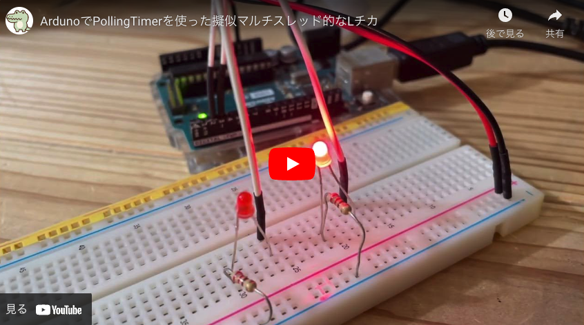

# PollingTimer Library for Arduino and ESP32


`PollingTimer`は、シングルスレッドで非ブロッキンなタスク処理を実現させるべく作ったライブラリです。


下記動画のように、擬似的なマルチスレッドが実現できます。

<iframe loading="lazy" width="560" height="315" src="https://www.youtube.com/embed/0vzSfgHvaY4" title="YouTube video player" frameborder="0" allow="accelerometer; autoplay; clipboard-write; encrypted-media; gyroscope; picture-in-picture" allowfullscreen></iframe>

また、マルチスレッドでは変数を`volatile`や`Mutex`などで管理しなければならず面倒です。非ブロッキンな工夫をすればシングルスレッドで十分、というのが私の経験上の感想です。


## 説明
`PollingTimer`は、ArduinoおよびESP32用に設計されたシンプルなタイマーライブラリです。このライブラリは、ポーリングに基づくタイマー機能を提供し、擬似マルチスレッドのような操作を可能にします。割り込み処理を避けることで、状態管理を容易にします。直感的なAPIを通じて、定期的なタスクや特定の遅延後の操作を簡単にスケジュールできます。

## 主な機能
- シンプルなインターフェース：setIntervalメソッドを使用して、コールバック関数と実行間隔を設定します。
- 柔軟なタイマー制御：タイマーを開始（fire）、停止（cancel）、および状態を確認（isFired）します。
- ループおよびワンショットタイマー：繰り返しまたは一回限りの実行を選択できます。
- デバッグサポート：デバッグモードでは、詳細なログ出力が可能です。


## 使い方

cloneまたはzipファイルをダウンロードして、`PollingTimer.h`および`PollingTimer.cpp`をライブラリディレクトリへ直接配置します。

プログラム内で`PollingTimer`をインクルードします。 

```cpp
#include "PollingTimer.h"
```

タイマーのインスタンスを作成します。

```cpp
PollingTimer timer;
```

そして`setup`内で、`setInterval`を呼び出し、コールバック関数の登録や、実行間隔（ms）、ループの有無を設定します。

```cpp
timer.setInterval(yourCallbackFunction, interval, isLoop);
```

その後、`fire`でタイマーを発火させます。

```cpp
timer.fire();
```

最後に、`loop`イベント内で`handler()`を呼び出します。

```cpp
void loop() {
    timer.handler();
}
```


## 注意事項
`PollingTimer`はシングルスレッドで動作しているため、登録したコールバック関数内の処理中はループイベントはブロックされます。ですからコールバックイベント内では、不要な`delay`などは使わずに、早く抜けられるようにする工夫をしてください。

## 使用例


冒頭で紹介した擬似マルチスレッドなLチカを実現すべく、`PollingTimer`を使った例です:

```cpp
#include "PollingTimer.h"
PollingTimer timer;

void blinkLED() {
    // Code to toggle LED state
}

void setup() {
    pinMode(LED_BUILTIN, OUTPUT);
    timer.setInterval(blinkLED, 1000, true);
    timer.fire();
}

void loop() {
    timer.handler();
}
```

詳しくは[リポジトリ](https://github.com/aragig/PollingTimer)内の、exampleフォルダーをご覧ください。


## Overview
The `PollingTimer` is a simple timer library designed for Arduino and ESP32. This library offers timer functionalities based on polling, enabling pseudo-multithreading-like operations. It eschews interrupt processing for easier state management. Through its straightforward API, it allows easy scheduling of periodic tasks or operations after a specific delay.

## Key Features
- **Simple Interface**: Use the `setInterval` method to set up the callback function and execution intervals.
- **Flexible Timer Control**: Start (`fire`), stop (`cancel`), and check the state (`isFired`) of the timer.
- **Loop and One-shot Timers**: Choose between repeating or single execution.
- **Debug Support**: Detailed log output is possible in debug mode.


## How to Use
1. **Include the Library**:
   ```cpp
   #include "PollingTimer.h"
   ```

2. **Create a Timer Instance**:
   ```cpp
   PollingTimer timer;
   ```

3. **Set Up the Timer**:
   ```cpp
   timer.setInterval(yourCallbackFunction, interval, isLoop);
   ```

4. **Start the Timer**:
   ```cpp
   timer.fire();
   ```

5. **Call Handler in Main Loop**:
   ```cpp
   void loop() {
       timer.handler();
   }
   ```

## Example

[](https://youtu.be/0vzSfgHvaY4)

Here's a simple example of blinking an LED:
```cpp
#include "PollingTimer.h"
PollingTimer timer;

void blinkLED() {
    // Code to toggle LED state
}

void setup() {
    pinMode(LED_BUILTIN, OUTPUT);
    timer.setInterval(blinkLED, 1000, true);
    timer.fire();
}

void loop() {
    timer.handler();
}
```

Please also see the examples folder.


